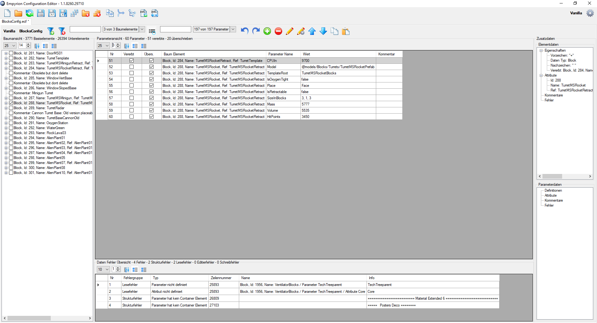
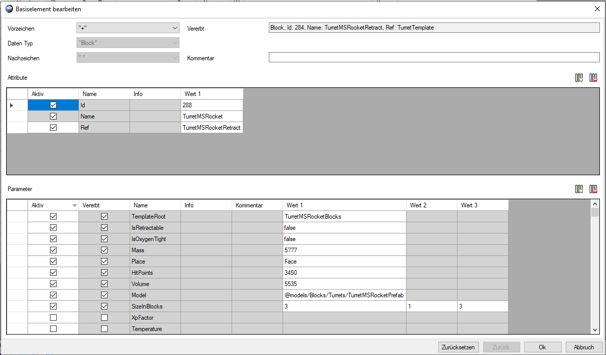
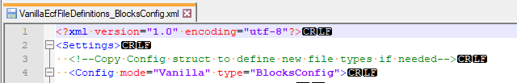

# :wrench: In Change for Release 1.1 :wrench:
# Empyrion Configuration Editor
An application to simplify the handling and customizing of the `.ecf` configuration files of [Empyrion Galactic Survival](https://empyriongame.com/)



## Content
- [Motivation](#motivation)
- [Installation](#installation)
- [Feature Overview](#feature-overview)
- [Operations Overview](#operations-overview)
- [Shortcuts and Functions](#shortcuts-and-functions)
- [File Content Definition](#file-content-definition)
- [File Content Recognition](#file-content-recognition)
- [Planned Major Features](#planned-major-features)

## Motivation
Over a long time lightweight modding [Empyrion Galactic Survival](https://empyriongame.com/) was really simple by adjusting the `config_example.ecf`. Due to the mechanic that the changes were added to the default settings, just the additional adjustments must be maintained. The decision of Eleon to remove these `add adjustments` feature simply felt like:


Now all the whole bunch of tons of settings must be maintained at once even if adjusting just one tiny value of one silly block. The awkward `.ecf` format makes this feel like:


You know what i'm talking about? Here comes the solution!


## Installation
Just download the latest release and unzip the content wherever you might need to. Run the executeable file and have fun!

## Feature Overview
### Content Definition
For each `.ecf` file the tool needs a definition. These definitions are located in `.xml` files in the `EcfFileDefinitions` sub folder of the zip package. For creating or adjusting the definitions yourself refer to [File Content Definition](#file-content-definition). After loading a `.ecf` file the definition is attached to it. To reinterprete a `.ecf` file with a different or changed definition the `.ecf` file must be closed and reopened. The actual version of the tool is shipped with definitions for:
- `BlocksConfig.ecf` (Vanilla and Reforged Eden)
- `BlockShapeWindow.ecf` (Vanilla)
- `Containers.ecf` (Vanilla and Reforged Eden)
- `DefReputation.ecf` (Vanilla and Reforged Eden)
- `EClassConfig.ecf` (Vanilla and Reforged Eden)
- `EGroupsConfig.ecf` (Vanilla and Reforged Eden)
- `Factions.ecf` (Vanilla and Reforged Eden)
- `FactionWarfare.ecf` (Vanilla and Reforged Eden)
- `GalaxyConfig.ecf` (Vanilla and Reforged Eden)
- `ItemsConfig.ecf` (Vanilla and Reforged Eden)
- `LootGroups.ecf` (Vanilla and Reforged Eden)
- `MaterialConfig.ecf` (Vanilla and Reforged Eden)
- `StatusEffects.ecf` (Vanilla and Reforged Eden)
- `Templates.ecf` (Vanilla and Reforged Eden) - needs further improvement -> planned feature `Ingame Item creation support`
- `TokenConfig.ecf` (Vanilla and Reforged Eden)
- `TraderNPCConfig.ecf` (Vanilla and Reforged Eden)

### Content Recognition
At file loading the tool parses the file content according to the attached definition. The tool is balanced to the variety of the subtleties of the spellings in the `.ecf` files. Due to the design goal `the output should match input in at much details as possible` the tool in its release state will likely also report failures in the default `.ecf` files of the game. This is not a tool bug, but developer inaccuracies that may or may not be compensated for by a fallback. In order to achieve reliable behavior, I have chosen to report such bugs rather than legitimizing these inaccuracies by the definition. For details see [File Content Recognition](#file-content-recognition).

### Content Creation
At saving a `.ecf` file the whole content in the file is wiped and recreated. At default setting elements with unsolved errors will not be written to the file. Instead the tool tries to recreate the data originially read from the file. Due to the nature of the `.ecf` syntax of consecutive specifications its recommended to
```diff
- solve errors from top to bottom
```
to not follow rabbits.

### Language and Tool Support
The icons and controls have tooltips on mouse over. All labels and tootips are localised. At the moment de-DE and en-GB is supported. The language switches automaticly based on the local machine culture setting, defaulting to en-GB.

### Tool Overview
### Settings Area
The label shows the actual selected game mode and grants a temporary quick change option on click. The gear button opens the persistent settings menu. 


#### File Operation Area
The standard file operations (new, open, reload, save, close) are located in this area. The cross-file functions (diff, merge, xml) are also arranged here.


#### Filter and File Selection Area
In this area each opened file will get a tab containing the file name. The label in the tool line indicates the attached game mode and content definition, for example `Vanilla` and `BlocksConfig`. The remaining icons provide different filter options applied to all content view areas.


#### Content Operation Area
The tools in this area provide content altering options like adding, editing or removing elements. The copy/paste function is located here, too.


#### Tree View Area
The tree view area brings the structural overview. The root elements, child elements, parameters and comments are displayed in this view. If an element has an error the entry in this view will turn red.


#### Parameter View Area
The parameter view area shows the detail information of any parameter correlating to the selected tree element. Additionally the view analyzes and displays the inheritance dependancies to referenced elements to provide a overview over all parameters effecting the selected element. If an parameter has an error the entry in this view will turn red.


#### Info View Area
The info area displays additional detail information for the selected tree element and the selected parameter. Especially the element attributes (e.g `formatter`) can be found here.


#### Error View Area
In the error view all occured errors are listed. The view shows the error category and type together with additional information like line in file (if applicable) and the error producing data part.


### Mass Changing
:wrench: Not implemented yet :wrench:

### Compare and Merge
:wrench: Not implemented yet :wrench:

### Tech Tree Preview
:wrench: Not implemented yet :wrench:

### Ingame Item Creation
:wrench: Not implemented yet :wrench:

## Operations Overview
### Changing settings

The gear button (  ) opens a settings panel with several settings. The `abort` button closes the panel and discarding all changes. The `save` button saves the settings persistent and closes the panel. The `reset` button reloads the default settings.


### Opening a file
After selecting the file to open the tool tries to guess which definition fits to the file by examining the file name. If this is successful the guessed definition is automaticly selected in the following dialog. In this case the Dialog can be skipped with `Ok`. When the guessing fails or a new file is created the definition must be selected manually from the provided drop down list.


For especially big files like `BlocksConfig.ecf` (or especially lame PCs :zany_face:) a loading dialog is shown while parsing the file content. 


### Adding And Editing Content
At adding or editing (see [Shortcuts and Functions](#shortcuts-and-functions)) the editor dialog is shown. The dialog is designed to not produce elements with errors. To achive this support pre opening checks, pre filled selection lists and pre closing checks will be performed. These logics depends primary on the attached file definition and the present content data.

At multi selection the panel will normally open for the first selected element. If only parameters are selected (even across parent element borders) the panel will enter a matrix edition mode. This mode provides a table organized structure for matrix arranged parameters or to edit equal parameters of different parents in one view.



## Shortcuts and Functions
### Shortcuts
- `double-click` opens the edit panel for the clicked item
- `right-click` opens the context panel for the clicked item
- `delete` key removes the selected items
- `strg + c` key copies the selected items to the clipboard
- `strg + v` key pastes the copied items into the selected item, or after it if insertion is not allowed for the item

### Context Panel
#### Tree View Context Panel
The context panel of the tree view provides access to the content operations suitable for tree items.


#### Parameter View Context Panel
The context panel of the parameter view provides access to the content operations suitable for parameter items.


#### Error View Context Panel
The context panel of the error view has support functions for error tracking.


### Sorting
The three listing views [Tree View Area](#tree-view-area), [Parameter View Area](#parameter-view-area) and [Error View Area](#error-view-area) have a sorting panel each. The sort panel provides settings for concurrent items and various sorting options.


### Icons
#### Settings
-  opens the settings panel

#### File Operations
-  create new file
-  open existing file
-  reload content from selected file
-  save selected file
-  save selected file with new name
-  save filter result to file
-  save all opened files
-  close selected file
-  close all open files
-  compares two files and displays differences (see [Compare and Merge](#compare-and-merge))
-  merge two files to one (see [Compare and Merge](#compare-and-merge))
-  displays the tech tree preview (see [Tech Tree Preview](#tech-tree-preview))
-  reloads the `.xml` definitions (see [File Content Definition](#file-content-definition))
-  checks the `.xml` definitions (see [File Content Definition](#file-content-definition))

#### Filter and Sorting Operations
-  apply filter
-  clear filter
-  show item with / without error
-  switch the sort direction
-  sets sorting to the origin (file) order
-  sets sorting to alphabetic order

#### Content Operations
-  add item to / after selection
-  editing first selected item
-  editing items with logics (see [Mass Changing](#mass-changing))
-  removing selected items
-  copy selected items
-  paste copied items to / after selection
-  undo last change
-  redo last undo
-  move selected items up
-  move selected items down
-  add value slot after selection
-  add value group after selection
-  remove selected value slot
-  remove selected value group

#### Error Operations
-  show error in tool
-  show error in file

## File Content Definition
The file content definition is the basic information for the tool which content is viable in the loaded `.ecf` file and which is not. To achive the design goal to be reliable able to load and interprete `.ecf` files from any source (default files, text editor tool files, manually edited files and so on) the definition provides several options. 

The defintions will be read from the `EcfFileDefinitions` sub folder from the tool root directory. The file name doesn't matter. Each file in this directory will be read, even in sub directories. The first entry in each file must contain the game mode and the definition name, both also shown in the tool. The definition name is the link to the corresponding `.ecf` file (for guessing) and must be unique. Every further `.xml` file with the same `mode` and `type` setting will be ignored.



If the `EcfFileDefinitions` sub folder is missing or empty the tool will create a simple template `.xml` file for `BlocksConfig.ecf`. This file can be used as starting point for creation of own files and is structural complete, but will likely be incomplete compared to the expected `.ecf` content.

After starting the tool the present `.xml` files are loaded and prepared for use. Changing the `.xml` files after running the tool will not be recognized by the tool. If you want the tool to reload the definitions just hit the respective button (  ). Due to the intended behaviour to not alter the definitions of opened `.ecf` files, reloading the '.xml' definitions or changing the game mode setting not effecting already opened `.ecf` files.

After bigger patches of [Empyrion Galactic Survival](https://empyriongame.com/) a definition maybe can partly went deprecated. In this case a backwards check of the definition is recommended. This can be done (if I'm too lame to release an update :sleeping:) by hitting the respective button (  ). This function compares the actual selected `.ecf` file against the latest loaded `.xml` definition of the same type and lists the `.xml` content definition for which no content is found in the `.ecf` file.

### Xml File Content
The definition uses often the terminology `Block`. Don't missinterprete this with an `Empyrion ingame block`. In Xml-speaking `Block` stands for a `.ecf data block`.

The `formatting` chapter of the `.xml` files provides settings for the basic `.ecf` syntax. This chapter should mostly be similar for all `.ecf` files.


After the `formatting` follow the sub chapters for the different elements of the `.ecf` files. This chapter contains the expected `.ecf` content.


The available chapters are:

- `BlockTypePreMarks` the expected pre marks after the block opener (e.g. `+`)
- `BlockTypePostMarks` the expected seperators to define the end of the block type (e.g. ` `)
- `RootBlockTypes` the expected data types of blocks in the root level (e.g. `Block`)
- `RootBlockAttributes` the expected attributes for blocks in the root level (e.g. `Id`) 
- `ChildBlockTypes` the expected data types of blocks not in the root level (e.g. `Child`)
- `ChildBlockAttributes` the expected attributes for blocks not in the root level (e.g. `DropOnDestroy`)
- `BlockParameters` the expected parameters for the data blocks (e.g. `Material`)
- `ParameterAttributes` the expected attributes for the parameters (e.g. `formatter`)

Each `.xml Param` line item can hold different switches to control the behaviour of the error checking while parsing and editing the `.ecf` content. The chapters are allowed to be empty, but remind that the respective functions in the [Editor Panel](#adding-and-editing-content) will be switched off without the definition.


- `name` the name of the `.ecf` element (e.g. `Material`)
- `optional` determines if this element is optional, non-optional elements will be treated as mandatory and can in some cases overwrite optional ones
- `hasValue` determines if this element has (reading) / should have (creation) a value
- `allowBlank` determines if for this element a `empty value` is allowed 
- `forceEscape` determines if at creation this element must be escaped, useful for text references like `TechTreeParent`
- `info` a free text to preserv designer infos for the element, shown in the tool, not written to the file

## File Content Recognition
The Parsing of the `.ecf` tries to interprete the whole variety of spellings present in the different files. To minimize result validation efforts and to preserv the readability of the files by [Empyrion Galactic Survival](https://empyriongame.com/), the tool reproduces nearly the same spelling as the original file.

The exceptions are the white spaces, the empty lines and the comments. All the function-irrelevant white spaces and empty lines will be remove. All the different varieties of comment spellings will be streamlined to appended inline comments.

The tool parses the `.ecf` file content line by line and seperates the line content item by item according to the definition and chronologic. A fault can depending on its severity lead to a whole bunch of follower errors. This is the reason of solving errors from top to bottom.

In the settings are several behaviour adjustments possible how the tool should handle errors at wrting content to the file:
- `Write only valid items to file` Unchecking this option activates the behaviour that all elements will be written in its current state from within the tool. Notice that the file is the persistent storage. After loading a file written with this option unchecked several informations and the resulting errors will be gone.
- `Invalidate parent of invalid item` Checking this option activates the behaviour that error states will be inherited structure upwards. A error of a sub element invalidates its containing element upto the root element. 
- `Allow fallback to original data` Unchecking this option activates the behaviour that elements with errors has no permission to try to use the data from the original file. In this case a creation error will be reported. Notice that even with this option checked the error could occur for newly created elements which have no original data available.

The default setting will not write elements with errors to the resulting file and the tool will try to recreate the data read from the original file. In the error view all occured errors will be listed. The errors belong to the four categories `structural`, `interpretation`, `editing` or `creation`:

### Structural Error
This errors occur during the parsing of the content at the loading of the `.ecf` file. The corresponding line in the file violates the syntax in a manner which makes it impossible to attach this data to the managed structure within the tool. Such an error must be corrected in the original file if the data content is needed.

### Interpretation Error
This errors occur during the parsing of the content at the loading of the `.ecf` file. It means that the found data basically fits to the `.ecf` syntax but the content is unknown or contains invalid data compared to the definition. It can in mostly all cases be corrected in the tool.

### Editing error
This errors occur during content editing in the tool at operations which would consume too much performance to prevent it by a pre check (or similar). It has the same meaning as `Interpretation errors` and can in all cases be corrected in the tool.

### Creation error
This errors occur during content writing at hitting `save`. This error depends on the error handling settings. It only reports elements that should be written but according to the settings no writeable data is available/permitted. It states if an element is not written because it contains an error and no fallback data from parsing could be found.

## Planned Major Features
:wrench::wrench::wrench: The next step will be the compare / merge feature. :wrench::wrench::wrench:

- Compare files view
- Merge files with behaviour selection
- Ingame Item creation support
- Element, Parameter, Comment moving
- TechTree Preview
- Element, Parameter, Attribute, Comment mass changing (base on filter/types)
- SaveAs with taking applied filter into account
- Undo / Redo
